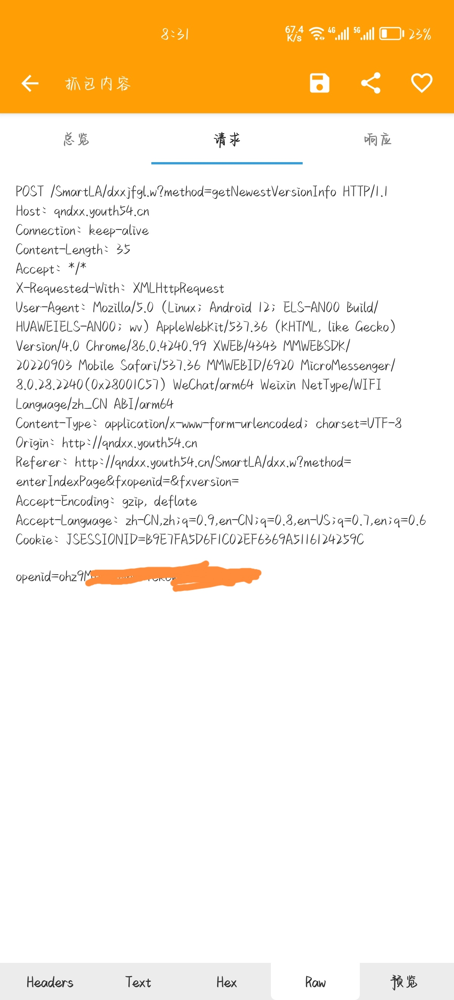

## big-stydy-doge

不知道怎么起英文名，也难怪url里全是dxx（摊手）

### 代码&流程

做大学习的代码参考自https://github.com/captain686/Youth-Learning

其实就是直接揪出了关键代码。

查询大学习情况的代码自己写的，使用的是正则表达式

流程就是先获取当前大学习是哪一期，如果没完成就发请求完成，完成了就直接跳过

&nbsp;

### 控制字段

目前代码控制字段都在代码头部给出，解释如下：

```py
#你的微信OpenID，相当于身份证明
openid = '----'
#是否打印大学习的学习记录，默认关闭
printHistory = False
```

&nbsp;

### OpenID

由于微信公众号使用openid验证身份，而且是不会过期的，所以需要抓包去找openID。

🍎IOS用户可使用Stream进行抓取

> 1. 在设置里设置 `HTTPS`抓包
> 2. 设置抓包模式为白名单模式
> 3. 添加抓包域名 `*.youth54.cn`
> 4. 开启抓包访问青年大学习
> 5. 筛选抓包历史中的 `POST`请求可以找到 `openid`

😊 安卓系统可以使用`HttpCanary`进行抓包（不需要root，装CA可选，也不是必要的）

> 1. 在主界面点击加号选择微信
> 2. 开启抓包访问青年大学习
> 3. 在抓包历史中搜索youth54.cn，找到`POST`请求可以找到`openid`
>
> 你也可以选择使用电脑微信抓包
>
> 具体细节`百度谷歌`

HttpCanary放在仓库里，抓包样例如图，很简单。



openId拿到后扔到代码里直接run就好。

或者你也可以直接用postman。

&nbsp;

### Q&A

Q：为什么不用github action？

A：被ban了

Q：我有自己的服务器，用服务器跑可不可以？

A：我觉得没啥问题，但是服务器一般在省外，不知道会不会有限制或者被ban。
