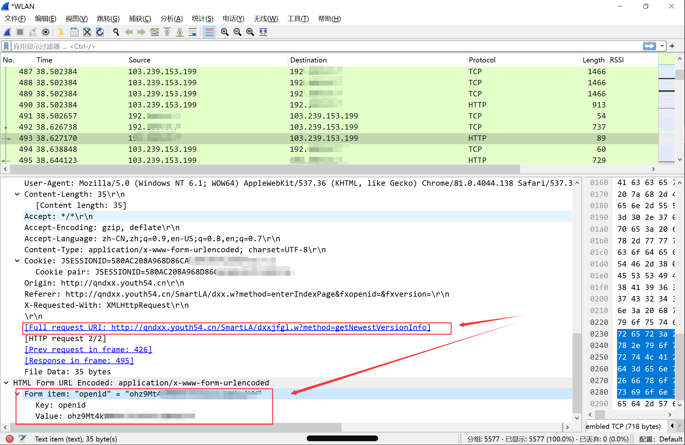

## big-stydy-doge

不知道怎么起英文名，也难怪url里全是dxx（摊手）

> 仅作学习用途

### 使用教程

#### 如果那你是程序员

建议使用git，这样更新起来方便一些：

```sh
git clone https://github.com/ZWN2001/big-study-doge-script.git
```

更新的时候直接`git pull`就行

使用你的IDE打开`main.py`，配置好字段后运行即可。

**openid的获取在后文讲**。

#### 如果你没有安装git

对于其他专业的同学来说，git并不是什么生产力工具，我的建议是直接点击绿色按钮code，下载zip之后，使用你的IDE打开`main.py`，配置好字段后运行即可。

更新的时候在github中打开`main.py`复制下来替换到你本地的代码即可。

当然，为了不错过更新，你可以点个star，这样你就能在自己star的历史中找到（doge

不过真的有人不装git却使用github吗（挠头）

什么？你说你没装py环境？那可真没救了。不过以后有时间或许可以打包成一个exe发release，这样win环境下的同学使用起来确实就可以免除安装py环境的麻烦（不会吧不会吧，不会有人电脑上连py环境都没有吧）

别问我问什么不发布Mac版，除非你愿意赞助我一台Mac先（手动狗头

&nbsp;

### 代码&流程

做大学习的代码参考自https://github.com/captain686/Youth-Learning

其实就是直接揪出了关键代码。

查询大学习情况的代码自己写的，使用的是正则表达式

流程就是先获取当前大学习是哪一期，如果没完成就发请求完成，完成了就直接跳过

&nbsp;

### 控制字段

目前代码控制字段都在代码头部给出，解释如下：

```py
#微信OpenID，相当于身份证明，可以添加多个
openids = ['----','----']
#是否打印大学习的学习记录，默认关闭
printHistory = False
#代理，这样请求时就不需要把自己的代理关掉，鉴于PyCharm有时候确实对代理比较敏感
proxies = {"https": 'https://127.0.0.1:7890'}
```

&nbsp;

### OpenID

由于微信公众号使用openid验证身份，而且是不会过期的，所以需要抓包去找openID。

🍎IOS用户可使用Stream进行抓取

> 1. 在设置里设置 `HTTPS`抓包
> 2. 设置抓包模式为白名单模式
> 3. 添加抓包域名 `*.youth54.cn`
> 4. 开启抓包访问青年大学习
> 5. 筛选抓包历史中的 `POST`请求可以找到 `openid`

😊 安卓系统可以使用`HttpCanary`进行抓包（不需要root，装CA可选，也不是必要的）

> 1. 在主界面点击加号选择微信
> 2. 开启抓包访问青年大学习
> 3. 在抓包历史中搜索youth54.cn，找到`POST`请求可以找到`openid`
>
> 你也可以选择使用电脑微信抓包
>
> 具体细节`百度谷歌`

HttpCanary放在仓库里，抓包样例如图，很简单。


当然也可以选用win比如wireshark，不过门槛要稍微高一点，但是原理是一样的，样例如下



openId拿到后扔到代码里直接run就好。

或者你也可以直接用postman。

>##PS.这个openID是不会变的，所以抓包抓一次就ok了！##

&nbsp;

### Q&A

Q：为什么不用github action？

A：被ban了

Q：我有自己的服务器，用服务器跑可不可以？

A：我觉得没啥问题，但是服务器一般在省外，不知道会不会有限制或者被ban。
